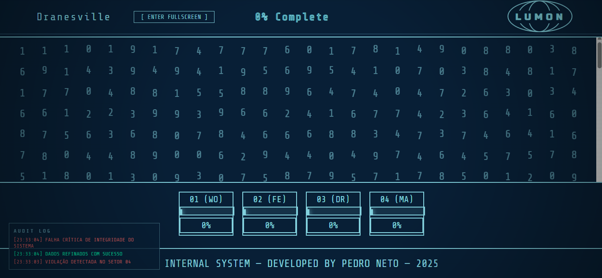

  

# Severance_Interface2.0

## 🇧🇷 Sobre o projeto

Este projeto é uma **interface experimental autoral**, inspirada na estética e nos conceitos da série *Severance (Ruptura)*.  
O foco está na interação homem–sistema, controle comportamental, feedback visual progressivo e resposta do sistema às ações do usuário.

A aplicação utiliza um **grid dinâmico interativo**, com seleção visual, progressão por categorias, alertas de violação de protocolo e instabilidade progressiva quando o usuário não segue as regras do sistema.

O sistema já está **funcional e conceitualmente sólido**, porém o próximo passo do desenvolvimento é **refinar performance, fluidez visual e otimizações de renderização**, especialmente em cenários com grande volume de elementos na tela.

---

## 🇺🇸 About the project

This project is an **authorial experimental interface**, inspired by the aesthetics and thematic concepts of the TV series *Severance*.  
It explores human–system interaction, behavioral control, progressive visual feedback, and system responses based on user actions.

The application features a **dynamic interactive grid**, including visual selection, category-based progression, protocol violation alerts, and gradual system instability when rules are ignored.

The system is currently **stable and conceptually complete**, with future improvements focused on **performance optimization, visual smoothness, and rendering efficiency**, especially when handling a large number of on-screen elements.

---

## 🧠 Conceitos explorados | Explored concepts

- Interação controlada (Controlled interaction)
- Feedback visual progressivo (Progressive visual feedback)
- Sistema responsivo ao comportamento do usuário (Behavior-driven system)
- Estética minimalista e institucional
- Experiência inspirada em interfaces narrativas

---

## 🛠️ Tecnologias utilizadas | Technologies

- HTML5  
- CSS3 (Grid, animações e transições)  
- JavaScript (DOM, eventos, lógica de sistema)  
- Python (estrutura e lógica complementar do projeto)

---

## 🚧 Próximos passos | Next steps

- Otimizar o desempenho do grid
- Reduzir custo de renderização e repaint
- Tornar animações mais leves
- Melhorar responsividade em telas menores
- Refinar microinterações

---

## 👤 Autor | Author

**Pedro Neto**  
Projeto autoral — 2025

---

> Este projeto é experimental e conceitual.  
> Não possui vínculo oficial com a série *Severance*.
